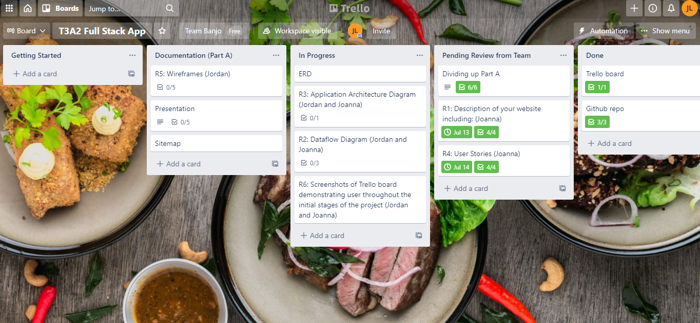

# T3A2-B - Joanna and Jordan - Kimchi & Kpop

## Deployed Website link

[Deployed website link]([https://](https://kimchiandkpop.netlify.app/))
[Deployed back-end](https://quiet-atoll-98684.herokuapp.com/)

## Instructions

Navigating to the provided website link will take you to the customer portal. This is what customers will be able to see and interact with. To view the staff portion of the website, manually navigate to `https://kimchiandkpop.netlify.app/staff`. You can log in with username admin and password password. 
## GitHub Repo

[Front-end repo](https://github.com/Team-Jordan-Joanna-T3A2/kimchikpop_frontend)
[Back-end repo](https://github.com/Team-Jordan-Joanna-T3A2/kimchikpop-api)

## Purpose

This full-stack web application came to be when we were approached by our client - the owners of a small Korean restaurant. They were a young couple who had opened a Korean restaurant in the Melbourne CBD in 2019. Their business has been thriving and increasing since their opening because of the delicious food,quick service that they provided and affordable prices. With the COVID pandemic starting in March 2020 however, the client found that they needed to adapt their online presence to fit in with the current and ever-changing COVID restrictions. It was with this purpose that the client sought our team and commissioned us to create a better web application that would scale and adapt with their increased sales and the constantly evolving COVID restrictions and regulations.

This web application serves to fulfill two main purposes. Firstly, it will be a web portal where potential diners and customers can access the website to get more information about the restaurant, information like the restaurant's address, menu, contact number, pictures of food etc. Secondly, in-line with the COVID-safe restrictions, diners are able to use this web portal to book a table and timeslot and input their contact details for easy contact tracing should the need arise.

Before hiring our team to make this application, the restaurant's online presence consisted of an Instagram page. So if potential diners wanted to access information like the menu, opening hours etc it was all shown on their Instagram profile description. And when diners wanted to book a spot, they had to Direct Message(DM) the restaurant owners via Instagram or call in. In essence, this was not the most user-friendly booking system for a restaurant as it was reliant on a back and forth in a Instagram DM conversation or with a phone call, making the whole booking process inefficient and pulling our client's attention away from cooking or serving the diners. This was also further complicated by COVID restrictions and their restaurant becoming popular and attracting increasingly more diners.

As the diners increased and restrictions tightened, this meant that keeping track of the contact details of the diners was difficult as they came from two different sources (Instagram DMs and calling in) and it was on the couple to store that data in an easily accessible place should the information become necessary for contact tracing. Furthermore, potential diners were accustomed to a more official booking system where they received an e-mail confirmation of their booking and were able to easily manage their booking should the need to update or cancel a booking arose. With a booking system in place, the clients would then able to maximize the space that they have and be assured that they are not unnecessarily turning away potential diners and losing business while also having the confidence that they are operating safely within the current COVID restrictions.

In discussion with the client, they decided that it would be easier to have a separate website (that's not on Instagram) for their restaurant that would have the booking system on it. The client would have a secure dashboard where they could easily view the current bookings that are in place at the time of them viewing it and prepare the restaurant accordingly, they will not have to worry about the storing of bookings and contact details anymore but be able to refocus on making delicious food. The booking system will also improve the user experience of the diners and further encourage them to come back again making it a win-win situation.

## Functionality / features

### Main Web Portal

* Lists Opening Hours
* Lists Contact Number
* Lists Restaurant Address
* Shows Menu
* Shows Gallery (has pictures of food)

### Booking

* Ability to specify number of people in your party (up to 5)
* Ability to select a date to dine-in
* Ability to select a time to dine-in
* Ability to input contact details:
  * First Name and Last Name
  * Email
  * Phone Number
* Ability to save the contact details as a cookie to speed up future bookings  (to be added)
* Ability to recall bookings through the use of a reference number/code and edit or cancel the booking (to be added)

### Client:

* Has dashboard to view and delete all bookings
* Has dashboard to view today's bookings
* has admin privileges and can update the booking settings on the dashboard
* Can update website information e.g. changes to the menu, opening hours (to be added)

## Target audience

This application is aimed towards two main groups.

### 1. The Restaurant Owners

This is a young couple who started their business end of 2018 to early 2019. They are both relatively new to the restaurant business but have a passion for cooking delicious and affordably priced food.

They are fairly tech savvy but would like to further upgrade their current online presence so that they can more easily and efficiently handle the increase in diners while safely operating in accordance with the current COVID restrictions.

Another thing to consider is that contact details of the diners will be stored in an easily accessible way. In this way, should contact tracing need to be done, the clients will have the information ready and available for the Victorian government to utilize.

### 2. The Diners

The diners will represent the potential and returning customers of the restaurant.

With this target audience in mind, the website would be formatted in a standard way in the style of other popular restaurant sites. This is to ensure that navigation of the website is intuitive and is set up in a user-friendly way to encourage new and repeat diners.

The focus of the booking system format and functionality will keep this target audience in mind as they will be the primary ones using it.

## Tech stack

### Front-end

* React (Framework)
* HTML
* CSS
* Javascript

#### Additional front-end software

##### Testing

* @wojtekmaj/enzyme-adapter-react-17
* enzyme

##### UI

* Material UI - provides configurable components for many UI elements
* `react-date-picker` - provides a date picker so users can specify the date of their booking
* `axios` - provides promise-based web requests. Used to communicate with back-end
* `clsx` - allows the combination of multiple classes in MUI components

### Back-end

Ruby on Rails (Framework)

#### Additional back-end software

* `secure_random_string` - provides method to generate random string securely, used for booking codes
* `jwt` - allows a JWT token to be encoded and provided to the front-end which is used to authenticate logged in users

### Database

PostgreSQL

### Deployment

*Back-end* : Heroku

*Front-end* : Netlify

### Version Control

* Git
* Github

## R2

### Dataflow Diagram

*Utilized Gane-Sarson notation*

**Context Diagram – Level 0 DFD**

**Level 1 Data Flow Diagram**

* A user exists and has authentication
* The user choose to be guest only (no login) and still be able to create a booking
* The user can edit their booking and can make repeated bookings easily because contact details is saved and autofilled when logged in
* Guest users can edit their bookings using a ref number/code
* The user data is stored in user model database and booking data is stored in booking database

## R3
### Architecture Diagram

## R4

### User Stories

Initial User Stories

**Persona 1**

**Who:**

*Foodie diner* persona who is passionate about eating delicious well-made food.

**Goal:**

They want to be able to make informed decision on the places they eat in, making sure that the restaurant is up to their high standards.

**Problem:**

 Most restaurant websites are lacking in detail and not user-friendly.

**User Stories**

* I want to be able to see the menu and the pictures of the food before I make my decision to dine in this place.

* I want to get the contact number of the restaurant to be assured by the owners that they are abiding by the current COVID restrictions and cleanliness standards.

**Persona 2**

**Who:**

*Efficiency* persona is a person who likes things to be efficient,user-friendly, convenient and easily accessible.

**Goal:**

Their priority is that eating at the restaurant is the simplest thing in the world and that there is nothing that slows them down unnecessarily.

**Problem:**

They find it hard to know when the restaurant is open and where it's located. They struggle with lack of and counter-intuitive booking systems.

**User Stories**

* I want to check the opening hours from the website so that I can see if my favourite korean eatery is still open.

* I want to get the restaurant address to input into Google Maps so that I can easily find the restaurant and not lose time finding the place.

* I use the user-friendly booking system so that I am guaranteed a table in this popular eatery.

* I save my contact details in a login with the booking system so that I can easily make repeated bookings with just a few clicks.

**Persona 3**

**Who:**

The *Kitchen Manager* persona is someone who is responsible for the overall operations back of the house and kitchen area.

**Goal:**

To be able to make preparations for the day's work in the kitchen.

**Problem**

They have been guesstimating on how much food is needed to be purchased and sometimes purchase too much and would like to minimize waste.

**User Stories**

* I want to see how many potential diners the restaurant will have so that I am able to estimate how much food that needs to be purchased or ordered in advance.

**Persona 4**

**Who:**

The *host/hostess* is responsible for greeting the customers and seating them at their tables.

**Goal:**

Their goal is to greet and quickly seat diners.

**Problem**

Previously, all the bookings were written in a book and not well organized.

**User Stories**

* I want access to the confirmed bookings so that I can quickly and easily check that the diner has a booking for this timeslot.

**Persona 5**

**Who:**

The *head chef* persona is the one who oversees the cooking and food preparation.

**Goal:**

Their goal is to be able to plan out the cooking so that customers can be served what was ordered from the menu

**Problem**

When they have a new recipe that they want to serve to the customers, they need to be able to change the menu to include the recipe.

**User Stories**

I want to be able to edit the menu, so that I can cook and serve new recipes to the diners.

**Persona 6**

**Who:**

The *restaurant owner* persona is the main client who owns the restaurant and is commissioning this project.

**Goal:**

To be able to easily manage the restaurant with the web portal and adapt to the ever-evolving COVID restrictions.

**Problem**

The COVID restrictions change frequently and the restaurant details need to be changed alongside it.

**User Stories**

I want to make changes to the opening hours in the web portal to reflect the new working hours that is more financially viable during COVID lockdown.

---

After further consultation with the clients some extra user stories and features were proposed for the *restaurant owner* persona:

**Restaurant Owner User Stories (After consultation)**

* I want to encourage the diners to use Melbourne Money so that they become return customers.

* I want admin privileges to make sure that only I can edit the booking system settings and no one else.

* I want to have the diner's contact information easily retrievable should the Victorian Government need them.

* I want the booking settings to sync up with the new COVID restrictions so that I am assured that the restaurant is operating within the regulations.

## R5

### Wireframes

A walkthrough of the prototyped UI wireframes [can be accessed by clicking this link.](https://drive.google.com/drive/folders/1XwLILvUIB2874_YWrproKqh3Z4GWsh5I?usp=sharing)

| Annotation| Comments|
| -------- | -------------- |
| 1 | Global Navigation  |
| 2 | Restaurant Name positioned at the top to build branding. |
|3|Restaurant Address also positioned at the top to enable easy finding of crucial information.|
|4|By swiping right the user is able to navigate to the menu|
|5|Clicking on “DOWNLOAD MENU” will allow user to download pdf version of menu|
|6|Clicking on the “MAKE BOOKING” will bring the user to the Confirmation Page where the user is assured that their booking has been made and they will receive a confirmation email.|
|7|Booking confirmation page that user is brought to after submitting their booking|
|8|Clicking on "LOG IN" brings the administrator to the bookings system dashboard.|
|9|Clicking on "TODAY'S BOOKINGS" brings the administrator to the list of today's bookings|
|10|Clicking on "MANAGE" brings the administrator to"MANAGE BOOKING" screen where they are able to update the booking details or delete them.|

### Mobile Wireframes

### Tablet Wireframes

### Desktop Wireframes

**Design Notes:**

* The website has a minimalistic design with the crucial information positioned at the top.

* A consistent and global nav bar to ensure easy and intuitive navigation.

* Each page has a clear design with only the core information about the restaurant to help the user focus and not get overwhelmed by too many things at once.

* Background image is chosen to depict nature of the website's business - restaurant and food.

* Background image is consistent on the information pages. A white background is chosen for the booking pages to help the user focus.

## R6

### Screenshots of Trello

[Link to Trello](https://trello.com/b/GlyDoEN9/t3a2-full-stack-app)

Got started with the basics (trello board creation, github repo creation), divided up the tasks and assigned cards with name of team member responsible. Set initial due dates.

Began work on Rubric 1, Rubric 3 and Rubric 4 tasks.

Began work on ERD and Rubric 2 Dataflow diagram.

Completion of Rubric 1, Rubric 2, Rubric 4 and added in Part B tasks.
Added in labeling for MVP and coding, task difficulty. Added in more task due dates.

